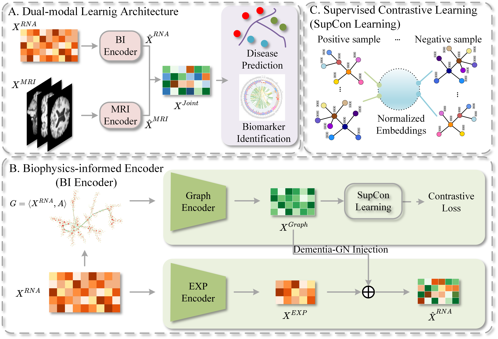

# SIMN: Multi-modal learning based diagnosis of neurodegenerative disorder by integrating whole-blood RNA sequencing and neuroimage data with biophysical constraints

Precision molecular diagnosis and treatment for dementia involves multi-omics data, including neuroimaging, omics, clinical metadata. Conventional multi-modal deep learning models face limitations in adapting to the strong heterogeneity of multi-omics data that are associated with neurodegeneration. Additionally, existing machine learning algorithms have high requirements for sample size and data quality. It is challenging to obtain sufficiently well-labeled datasets in the field of digital medicine research, which affects the accuracy and generalization ability of the model. In order to overcome these limitations, this study develops a biophysics-constrained multi-modal fusion architecture named MLBC under the framework of multi-modal learning. The proposed MLBC method has extracted and integrated dementia-specific gene networks(DementiaGN), and uses DementiaGN as a structure-based penalty term to guide the learning of multi-modal networks. In this way, this study aims to obtain diagnostic predictions that meet biophysical constraints, thus improving the accuracy and generalization ability of diagnostic models. Validation experiments about benchmark datasets illustrated that the proposed MLBC scheme has significantly improved the predictive accuracy and enhanced the generalization ability of the disease prediction model.

## Architecture

Overview of the MLBC method with biophysical constraints. The figure illustrates the MLBC architecture, which incorporates biophysical constraints to produce predictions that align with regulatory systems. The MLBC method consists of a transcriptomics branch and an MRI branch. The graph representations obtained from the graph learning branch are then injected into the expression representation to form a transcriptomics representation. Subsequently, the transcriptomics representation from the transcriptomics branch and the MRI representation from the MRI branch are fused to obtain a joint latent representation.




## Install

We train the MLBC model under the Ubuntu22.04, and graphics card is RTx4090.

```
conda create -n MLBC python==3.8
conda activate MLBC
```

## Requirements

```
pip install -r requirements.txt
```

## Data availability

In this study, whole-blood transcriptomics and neuroimaging data from PPMI {[Home | Parkinson's Progression Markers Initiative](https://www.ppmi-info.org/)} and ANMerge {https://www.synapse.org/Synapse:syn22252881}  have been employed as the training set. Downstream analysis tasks have been divided into two aspects, namely neurodegenerative disorder classification and cognitive ability assessment.


